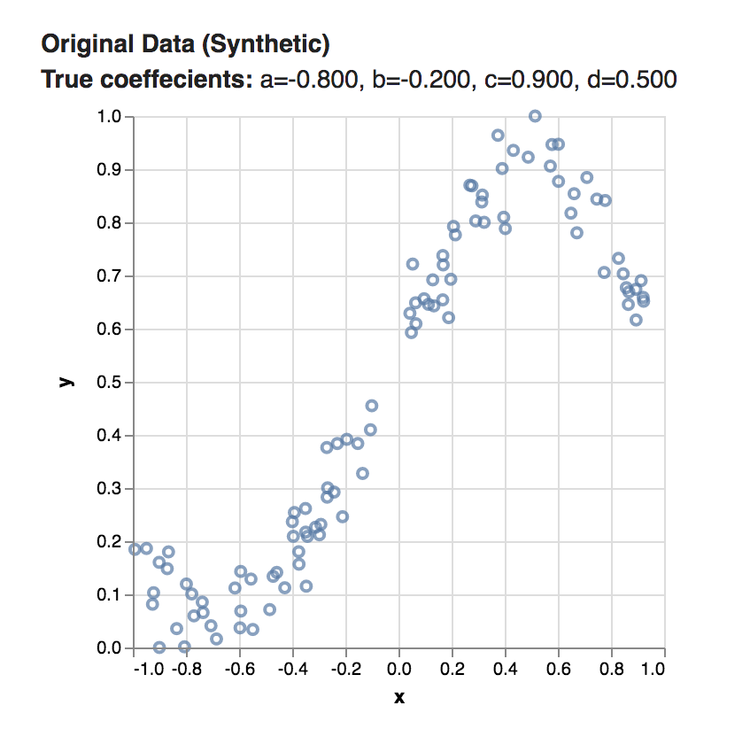
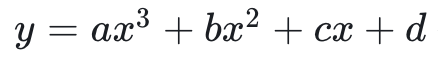
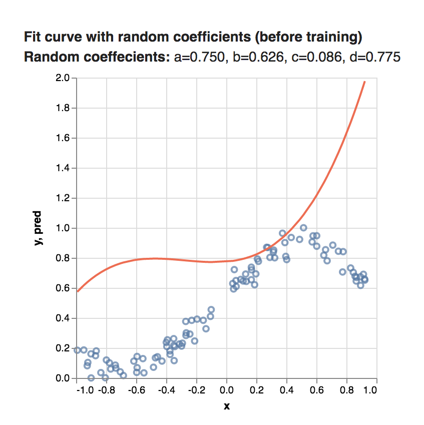
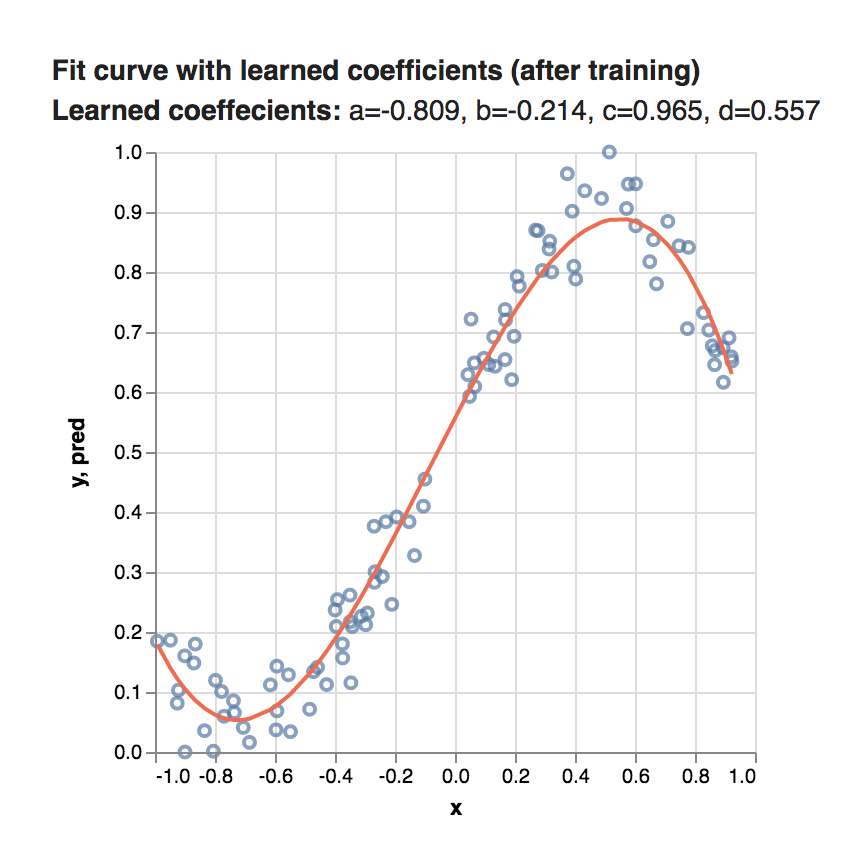

# Training First Steps: Fitting a Curve to Synthetic Data

In this first example we will have a model learn the parameters for a curve that we want to fit to some data. For this toy example we will generate a synthetic data using a polynomial function with some noise added. We will then have the model try to learn the coefficients used to generate the data.

The **full code** for this tutorial can be found [here](https://github.com/tensorflow/tfjs-examples/tree/master/polynomial-regression-core), we will just look at the interesting parts here and leave out parts like data generation and chart plotting.

To run the code locally do the following:

```
git clone https://github.com/tensorflow/tfjs-examples
cd tfjs-examples/polynomial-regression-core
yarn
yarn watch
```

The tfjs-examples/polynomial-regression-core directory above is completely standalone so you can copy it to start your own project.

## Input Data

Our data are x-y coordinates that look like this:



Here is the polynomial we used:



The thing we want to learn are the values of 'a', 'b', 'c', and 'd' that produces a nice curve that fits the data.

Lets take a look at how we might learn those values, known as _coefficients_, using TensorFlow.js **operations**.

## Set up variables

Our first step will be to create some variables to hold our current best guess of these values. Note that we start with random guesses for these values.

```js
const a = tf.variable(tf.scalar(Math.random()));
const b = tf.variable(tf.scalar(Math.random()));
const c = tf.variable(tf.scalar(Math.random()));
const d = tf.variable(tf.scalar(Math.random()));
```

## Write our model

```js
function predict(x) {
  // y = a * x ^ 3 + b * x ^ 2 + c * x + d
  return tf.tidy(() => {
    return a.mul(x.pow(tf.scalar(3, 'int32')))
      .add(b.mul(x.square()))
      .add(c.mul(x))
      .add(d);
  });
}
```

The code above implements the math in our polynomial function. Using the variables as coefficients. At the start we will get pretty bad results as the values of a, b, c, and d are random.

If we were to plot a curve using these random numbers in our polynomial function, we might get something like this. The orange line represents the values predicted by our model.



## Train our model

The final step is to have the model learn good values for the coefficients. To do this we need two things, a 'loss' function that tells us how good we are doing and a 'train loop' that will actually run our training data through our model.

```js
function loss(prediction, labels) {
  // Having a good loss function is key for training a machine learning model
  const meanSquareError = prediction.sub(labels).square().mean();
  return meanSquareError;
}
```

```js
function train(xs, ys, numIterations) {
  const numIterations = 75;
  const learningRate = 0.5;
  const optimizer = tf.train.sgd(learningRate);

  for (let iter = 0; iter < numIterations; iter++) {
    optimizer.minimize(() => {
      const pred = predict(xs);
      return loss(pred, ys);
    });
}
```

## See the results!

Once this is done we can take the final values of our variable a, b, c, and d and use them to plot a curve.



Much Better than random! The **full code** for this tutorial can be found [here](https://github.com/tensorflow/tfjs-examples/tree/master/polynomial-regression-core) feel free to download it and experiment with some of the different variables in the code.

