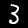
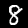
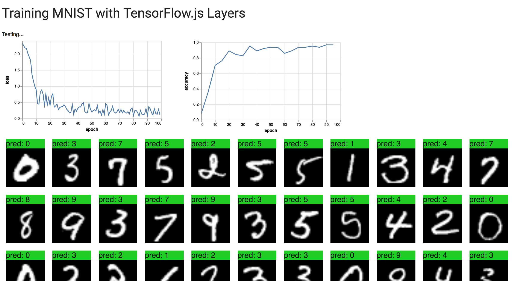

# Training on images — Recognizing Handwritten Digits with a Convolutional Neural Network

In the [core concepts tutorial](./core-concepts.html), we learned how to use tensors and operations to perform basic linear algebra.

In the [polynomial tutorial](./fit-curve.html), we learned how to use the TensorFlow.js core API
to learn the coefficients of a polynomial.

In this tutorial, we will learn the basic building blocks of a TensorFlow.js model to recognize handwritten digits with a convolutional neural network. The dataset we will be using is the [MNIST handwriting dataset](http://yann.lecun.com/exdb/mnist/).

## About this tutorial

This tutorial will explain the [tfjs-examples/mnist](https://github.com/tensorflow/tfjs-examples/tree/master/mnist) example in our examples repository.

The difference between this and the [tfjs-examples/mnist-core](https://github.com/tensorflow/tfjs-examples/tree/master/mnist-core)
example is that this uses the higher-level API (`Model`, `Layer`s) while mnist-core uses the low-lower linear algebra ops to build a neural network.

You can run the code for the example by cloning the repo and building the demo:

```sh
git clone https://github.com/tensorflow/tfjs-examples
cd tfjs-examples/mnist
yarn
yarn watch
```

The [tfjs-examples/mnist](https://github.com/tensorflow/tfjs-examples/tree/master/mnist)
directory above is completely standalone so you copy it to start your own project.

### What we will accomplish in this tutorial

- Create a convolutional classifier using supervised learning to recognize the digit (0-9) images of handwritten digits
- Train the classifier by having it “look” at thousands of handwritten digit images and their labels
- Evaluate the model's accuracy using test data that the model has never seen

The handwritten MNIST digits we will learn to classify look like this:

  

## Data

The MNIST example linked above has a file, [data.js](https://github.com/tensorflow/tfjs-examples/blob/master/mnist-core/data.js),
that contains a class `MnistData` which fetches random batches of images from a dataset on a server we provide for convenience.

`MnistData` splits the entire dataset into training data and test data. When we train the model, the classifier will only see the training set, and when we evaluate it we will only evaluate it with the data from the test set. By hiding the test set from the model during training, we can better see how well it has trained by evaluating it on unseen data.

When training the MNIST classifier, it is important that the data is randomly shuffled so the model isn’t affected by the ordering of the images we feed. For example, we were to feed all of the “1”s digits first, during this phase of training, the model might learn to simply predict “1”
(since this minimizes the cost). If we then fed it "2"s, it might simply switch
to predicting only "2" and never predict a "1" (since this minimizes the cost for
this new set of images). The model wouldn't then be able to make an accurate
prediction over any digit.

`MnistData` has two public methods:

1. `nextTrainBatch(batchSize)`: returns a batch of images and their labels from the training set
2. `nextTestBatch(batchSize)`: returns a batch of images and their labels from the test set

## Building the model

In this section, we're going to build a convolutional image classifier model.

To do this, we will use a `sequential` model which is the simplest type of model where tensors will be consecutively passed from each layer to the next.

```js
const model = tf.sequential();
```

Now that we have created a model, let's add layers to it. The first layer we’re going to add is a convolutional layer.

Convolutions slide a filter window over the image to learn transformations that are spatially invariant (this means that patterns or objects in different parts of the image will be treated the same). For more information about convolutions, check out
[this article](http://colah.github.io/posts/2014-07-Understanding-Convolutions/).

```js
model.add(tf.layers.conv2d({
  inputShape: [28, 28, 1],
  kernelSize: 5,
  filters: 8,
  strides: 1,
  activation: 'relu',
  kernelInitializer: 'VarianceScaling'
}));
```

When we construct a layer, we pass a configuration object that defines the structure of the layer. Let’s break down each argument to the configuration object.

```js
inputShape: [28, 28, 1]
```

The first layer of a model must define an input shape. This is the shape of the data that flows into the first layer of our model. In this case, our MNIST images we want to classify are 28x28 grayscale images. The canonical image format is [row, column, depth], so the input shape of the first layer is [28, 28, 1].

To take full advantage of the GPU to parallelize computation, we want to batch
several inputs together and feed them through the network using a single
feed-forward call.

Another reason we batch our computation is that during optimization, we update
internal parameters (taking a step) only after averaging gradients from several
examples. This helps us avoid taking a step in the wrong direction because of
an outlier example (e.g. a mislabeled digit).

To do this, we introduce a tensor of rank D+1 where D is the dimensionality of
a single input.

The dimensionality of a single image in this case is [28, 28, 1],
where the canonical format for images is [rows, columns, depth]. The image is
28x28 grayscale image, and thus has a depth of 1.

We will 64 grayscale images at a time, so the shape of this batch of 64 images
is [64, 28, 28, 1] (the batch is always the outer-most dimension).

*Note: Notice that the inputShape in the config of the conv2d did not specify the batch size (64). Configs are agnostic of batch size, to remain flexible and be able to take arbitrary batch size.*

```js
kernelSize: 5
filters: 8
strides: 1
```
These arguments define the parameters to the convolution.

`kernelSize` is the size of the sliding convolutional window, in this case it is a square 5x5 convolutional window.

`filters` determines how many 5x5 filters to be applyed to the input and learned.

`strides` determines the size of the step of the sliding window, in this case we will continually shift the window by 1 pixel.


```js
activation: 'relu'
```

This line determines the activation function to apply after the convolution. In this case, we are using the Rectified Linear Unit, which is a very common activation function in ML models.

```js
kernelInitializer: 'VarianceScaling'
```

`kernelInitializer` determines how we randomly initialize the weights. The way we initialize weights is very important to training dynamics. We won’t go into the details of initialization here, but `VarianceScaling` is generally a good initializer.

Great! We’ve constructed our first layer. Let’s add the other layers. The next layer we’re going to add is a max pooling layer. This layer will downsample the result (also known as the activation) from the convolution by computing the maximum value for each sliding window.

```js
model.add(tf.layers.maxPooling2d({
  poolSize: [2, 2],
  strides: [2, 2]
}));
```

Let’s break down the arguments.

```js
poolSize: [2, 2]
```

Pool size, similar to the kernel size in the convolution, determines the size of the sliding pooling window. In this case, for each 2x2 window the pooling layer will output the maximum value in the activation.

```js
strides: [2, 2]
```

Strides determines the size of the step between pooling windows. Here, we’re using a stride of 2x2. Since the window is 2x2 and the stride is 2x2, the pooling windows will be completely non-overlapping. This means the activation from the previous layer will be shrunk by 2x.

Now we do it again. Repeating layer structure is a common pattern in neural networks! Notice that the number of filters has doubled in this convolutional layer.

```js
model.add(tf.layers.conv2d({
  kernelSize: 5,
  filters: 16,
  strides: 1,
  activation: 'relu',
  kernelInitializer: 'VarianceScaling'
}));

model.add(tf.layers.maxPooling2d({
  poolSize: [2, 2],
  strides: [2, 2]
}));
```

Finally, we add a flatten layer to flatten the output of the previous layer to a vector and a dense layer (also known as a fully connected layer) to do classification. Flattening the output of a convolution / pooling layer before a dense layer is another common pattern in neural networks.

```js
model.add(tf.layers.flatten());
model.add(tf.layers.dense({
  units: 10,
  kernelInitializer: 'VarianceScaling',
  activation: 'softmax'
}));
```

Let’s break down the arguments to the dense layer.

```js
units: 10
```

This is the the size of the output activation. Since this is the last layer, and we’re doing a 10-class classification task (0-9 digits of MNIST), we use 10 units here. Sometimes this is known as the number of neurons, but we’ll avoid that terminology.

```js
kernelInitializer: 'VarianceScaling'
```

Just like the convolutional kernel, we use the same strategy to initialize dense layers as convolutional layers.

```js
activation: 'softmax'
```

The activation function of the last layer for a classification task is usually a softmax. This activation function normalizes the 10-dimensional vector into a probability distribution, which means we have a probability for each of the 10 output classes.

## Training the model

To actually drive the training of the model, we need to construct an optimizer, and define a loss function

```js
const LEARNING_RATE = 0.15;
const optimizer = tf.train.sgd(LEARNING_RATE);
```

The optimizer we’re going to use is "sgd" or "Stochastic Gradient Descent" (the
details of the optimizer are unimportant for this tutorial). Optimizers take a
learning rate argument, which determines how big of an update to make during
training. Too low a learning rate and training will be slow. Too high a
learning rate and the model might oscillate.

Now we compile the model, which makes the model trainable.

```js
model.compile({
  optimizer: optimizer,
  loss: 'categoricalCrossentropy',
  metrics: ['accuracy'],
});
```

The loss function we’re using is `categoricalCrossentropy`. This loss function is commonly used for classification task and measures the error between the probability distribution generated by the last layer of our model and the probability distribution given by our label (which will be a distribution with 100% in the correct class label).

We also want to compute accuracy, which is the percentage of examples the model
predicted the correct label.

For a 10-class classification problem, the label and predictions will both be
vectors with 10 elements representing the probability of that class.
Here is an example of what a label and a prediction
might look like from a trained model of the digit "7".

|class     | 0 | 1 | 2 | 3 | 4 | 5 | 6 | 7 | 8 | 9 |
|----------|---|---|---|---|---|---|---|---|---|---|
|label     | 0 | 0 | 0 | 0 | 0 | 0 | 0 | 1 | 0 | 0 |
|prediction|.1 |.01|.01|.01|.20|.01|.01|.60|.03|.02|

`categoricalCrossentropy` gives a lower loss value if the prediction is closer
to high probability of 7, and higher loss value if the prediction is lower probability of 7.

During the training phase, the model will update the internal parameters to
decrease this loss function over the whole dataset.

Before we begin training, we need to define a few more parameters.
```js
// How many examples the model should "see" before making a parameter update.
const BATCH_SIZE = 64;
// How many batches to train the model for.
const TRAIN_BATCHES = 100;

// Every few batches, test accuracy over many examples. Ideally, we'd compute
// accuracy over the whole test set, but for performance we'll use a subset.
const TEST_BATCH_SIZE = 1000;
const TEST_ITERATION_FREQUENCY = 5;
```

`TEST_BATCH_SIZE` is defined to be 1000, so we be test the model accuracy
against 1000 random examples every few steps.

### Training loop

Now we're ready to train the model. Here is the code for the training loop:

```js
for (let i = 0; i < TRAIN_BATCHES; i++) {
  const batch = data.nextTrainBatch(BATCH_SIZE);
 
  let testBatch;
  let validationData;
  // Every few batches test the accuracy of the mode.
  if (i % TEST_ITERATION_FREQUENCY === 0) {
    testBatch = data.nextTestBatch(TEST_BATCH_SIZE);
    validationData = [
      testBatch.xs.reshape([TEST_BATCH_SIZE, 28, 28, 1]), testBatch.labels
    ];
  }
 
  // The entire dataset doesn't fit into memory so we call fit repeatedly
  // with batches.
  const history = await model.fit(
      batch.xs.reshape([BATCH_SIZE, 28, 28, 1]),
      batch.labels,
      {
        batchSize: BATCH_SIZE,
        validationData,
        epochs: 1
      });

  const loss = history.history.loss[0];
  const accuracy = history.history.acc[0];

  // ... plotting code ...
}
```

Let's break this down.

```js
const batch = data.nextTrainBatch(BATCH_SIZE);
```

This fetches a batch of training examples. Recall from above that we batch examples
to take advantage of GPU parallelization and to average evidence from many
examples before making a parameter update.

```js
testBatch = data.nextTestBatch(TEST_BATCH_SIZE);
validationData = [
  testBatch.xs.reshape([TEST_BATCH_SIZE, 28, 28, 1]),
  testBatch.labels
];
```

Every 5 steps, we will compute the accuracy by constructing `validationData`
which is an array of two elements containing a batch of MNIST images and their
corresponding labels.

```js
// The entire dataset doesn't fit into memory so we call fit repeatedly
// with batches.
  const history = await model.fit(
      batch.xs.reshape([BATCH_SIZE, 28, 28, 1]),
      batch.labels,
      {
        batchSize: BATCH_SIZE,
        validationData,
        epochs: 1
      });
```

`model.fit` is where the model is trained and parameters actually get updated.

Calling model.fit() once with the whole dataset, will result in uploading the
whole dataset to the GPU, which could freeze the application. To avoid uploading
large amounts of data to the GPU, and risk freezing the application, we recommend
calling model.fit() inside a for loop, passing a single batch of data at a time.

Breaking down the arguments again:
```js
  batch.xs.reshape([BATCH_SIZE, 28, 28, 1])
  batch.labels
```

The first two arguments to `model.fit` are the `xs` and `ys` of our entire dataset.

```js
  batchSize: BATCH_SIZE
```

Remember that we are feeding examples in batches so we must tell the
`fit` function how large our batch is. `MnistData.nextTrainBatch`
returns images with shape `[BATCH_SIZE, 784]`, but our model expects a different
shape, so here we must reshape it.

```js
  validationData: validationData
```

By defining `validationData`, we are providing examples for `fit` to compute
our metrics over, in this case accuracy.


```js
  epochs: 1
```

Since we are iterative feeding batches to `fit`, we only want it to train from
this batch a single time.

```js
  const loss = history.history.loss[0];
  const accuracy = history.history.acc[0];
```

`fit` returns a rich object which contains logs from the fit call. The two we
care about plotting are the loss of the training batch and the accuracy of the
model over the 1000 test examples.

## See the results
If
you are following along in the example and have run it, you should see output
like this:



It looks like the model is predicting the right digit for most of the images!

The full code for this tutorial can be found [here](https://github.com/tensorflow/tfjs-examples/tree/master/mnist). Feel free to download it and tweak the parameters.
